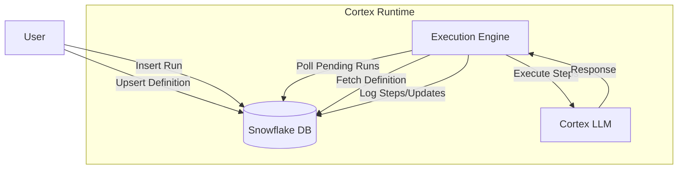

# Cortex Agent Runtime

**Cortex Agent Runtime** is a lightweight, Python-based runtime for orchestrating AI agents within the Snowflake Data Cloud. It provides a control plane for defining, executing, and monitoring agents directly where your data lives.

## Key Features

- **Snowflake Native**: Agents run and persist state directly in Snowflake tables.
- **Agentic Polling Loop**: A dedicated runtime that manages agent execution, tool calling, and memory.
- **SQL-Based Management**: Define and monitor agents using simple SQL queries.
- **Extensible**: Support for custom tools and different LLM providers (starting with Cortex).

## Getting Started

Ready to jump in? Check out the [Getting Started](getting-started.md) guide.

## How it Works

1. **Define**: Create an `agent.yaml` definition.
2. **Register**: Upsert the definition to the `AGENT_DEFINITIONS` table.
3. **Run**: Insert a run request into `AGENT_RUNS`.
4. **Execute**: The Runtime polls for pending runs and executes the defined steps.

